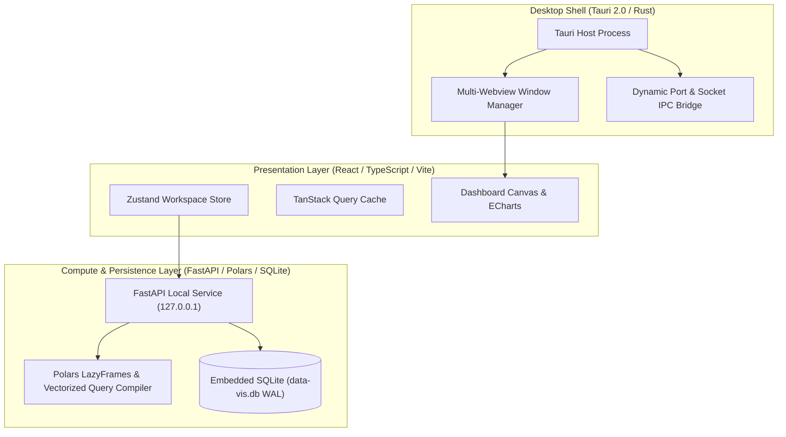

# data-vis: Local-First Data Visualization & Analytics Workbench

[](https://www.gnu.org/licenses/agpl-3.0)
[](https://tauri.app)
[](https://reactjs.org)
[](https://pola.rs)
[](https://fastapi.tiangolo.com)
[](https://www.typescriptlang.org)
[](https://www.python.org)

> [!WARNING]
> **🚧 Project Under Construction 🚧**  
> This project is currently under passive pre-release development. Features, APIs, and file structures may undergo modifications before the stable v1.0.0 release.

---

## 1. Overview

**`data-vis`** is a modern, local-first, open-source desktop data visualization and exploratory analysis workbench. It empowers data analysts, researchers, scientists, and engineers to load multi-gigabyte tabular datasets, perform lightning-fast aggregations and filtering, and construct composable interactive dashboards--**100% offline with zero cloud telemetry, zero egress, and complete data sovereignty**.

### Key Value Propositions
* **Zero-Egress Data Sovereignty**: All data parsing, filtering, and rendering happens strictly on your local machine (`127.0.0.1`). No cloud uploads, no subscriptions, no tracking.
* **Vectorized Local Performance**: Powered by an out-of-core Python + Polars lazy query execution engine and Apache Arrow IPC streams, executing queries across 10+ million rows in $< 200\text{ ms}$.
* **Interactive Visualizations**: Rich charting suite powered by Apache ECharts (Line, Bar, Scatter, Pie/Donut, Area, Heatmap, Boxplot, Histograms) with smooth 60 FPS zoom, pan, and cross-filtering.
* **Detachable Multi-Window & Multi-Sheet Canvas**: Excel-style sheet tabs with the ability to detach/pop out any chart into independent native OS windows for multi-monitor workflows.
* **Portable Workspace JSON (`.vispack`)**: Workspace sessions, layouts, filters, and chart designs serialize into shareable, human-readable JSON files that preserve setup across devices without copying raw data files.
* **Zero-Setup Embedded SLM & NLQ**: Built-in natural language query engine that translates plain English into queries with zero external dependencies, plus optional 1-click embedded quantized SLMs and BYOK (Bring Your Own Key) for cloud LLMs.
* **Extensible Plugin Ecosystem**: Safe, decoupled plugin interfaces to distribute custom visualization renderers, file format parsers, and custom data transformation routines.

---

## 2. Architecture at a Glance



---

## 3. Documentation (The Immutable Source of Truth)

In strict accordance with the [**Development Directive**](./docs/12_DEVELOPMENT_DIRECTIVE.md) (*Docs before code, `docs/` is the single source of truth*), all architectural specifications and operational guides are maintained in the [`docs/`](./docs) directory:

1. [**00: Project Overview**](./docs/00_PROJECT_OVERVIEW.md) -- Vision, mission, problem statement, personas, goals and non-goals.
2. [**01: Product Requirements (PRD)**](./docs/01_PRODUCT_REQUIREMENTS.md) -- Functional specifications, NFRs, performance targets, and accessibility.
3. [**02: Data Architecture & Storage**](./docs/02_DATA_ARCHITECTURE.md) -- Polars LazyFrames, Arrow IPC, SQLite schema, dataset fingerprinting, and portable workspace JSON.
4. [**03: Technical Stack Specification**](./docs/03_TECHNICAL_STACK.md) -- Technology matrix, runtime dependencies, and architectural justifications.
5. [**04: Visual Design System**](./docs/04_VISUAL_DESIGN_SYSTEM.md) -- Theme tokens (Dark/Light mode), color palettes, typography, and workspace layout hierarchy.
6. [**05: Component Specifications**](./docs/05_COMPONENT_SPECIFICATIONS.md) -- Feature slices, backend service modules, and Tauri window management.
7. [**06: Local IDE Build Instructions**](./docs/06_BUILD_INSTRUCTIONS_LOCAL_IDE.md) -- Setup prerequisites, environment variables, dev commands, and debugging launch profiles.
8. [**07: Phased Implementation Plan**](./docs/07_IMPLEMENTATION_PHASES.md) -- Six-phase milestone roadmap and strict exit criteria.
9. [**08: API & Integration Specification**](./docs/08_API_AND_INTEGRATION.md) -- REST endpoints, Pydantic DTOs, error schemas, and plugin extension hooks.
10. [**09: Testing & QA Specification**](./docs/09_TESTING_AND_QA.md) -- Vitest, Pytest, Playwright suites, 10M row benchmarks, and quality gates.
11. [**10: Deployment & DevOps**](./docs/10_DEPLOYMENT_AND_DEVOPS.md) -- Cross-platform Tauri bundling, standalone Python sidecars, and GitHub Actions CI/CD.
12. [**11: Production Release Checklist**](./docs/11_PRODUCTION_CHECKLIST.md) -- Pre-flight security audits, performance gates, and sign-off criteria.

---

## 4. Quickstart for Developers

### Prerequisites
* **Node.js**: $\ge 18.18$ LTS
* **Package Manager**: `pnpm` $\ge 9.0$
* **Rust**: `cargo` / `rustc` $\ge 1.77$
* **Python**: `3.11+` with `uv` or `poetry`

### Installation & Development
```bash
# 1. Clone the repository
git clone https://github.com/your-org/data-vis.git
cd data-vis

# 2. Install frontend dependencies
pnpm install

# 3. Setup Python backend virtual environment
cd packages/backend
uv venv .venv
source .venv/bin/activate
uv pip install -e ".[dev]"
cd ../..

# 4. Launch Desktop Application in Development Mode
pnpm tauri dev
```

For detailed setup instructions, troubleshooting, and VS Code launch configurations, see [`docs/06_BUILD_INSTRUCTIONS_LOCAL_IDE.md`](./docs/06_BUILD_INSTRUCTIONS_LOCAL_IDE.md).

---

## 5. Implementation Roadmap (Phases)

* **Phase 0 (Complete)**: Comprehensive architectural documentation (`docs/00` to `docs/11`).
* **Phase 1 (Complete)**: Monorepo scaffolding, Tauri 2.0 shell, Vite frontend, and FastAPI backend skeleton.
* **Phase 2 (Complete)**: Core backend entities, SQLite repositories, Polars query compiler, and ingestion parsers.
* **Phase 3 (Complete)**: Core UI feature slices, ECharts visualization builder, filter controls, and multi-sheet grid.
* **Phase 4**: Embedded SLM / NLQ engine, multi-window canvas detachment, and plugin runtime.
* **Phase 5**: Cross-platform packaging, end-to-end testing, performance hardening, and v1.0.0 release.

---

## 6. License

This project is licensed under the **GNU Affero General Public License v3.0 (AGPLv3)** -- see the [LICENSE](./LICENSE) file for details.
