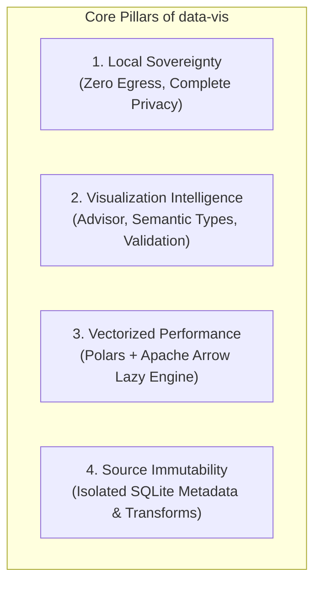

# 00: Project Overview

**Project Codename:** `data-vis` (Local-First Data Visualization & Analytical Exploration Workbench)  
**Version:** 1.0.0-rc  
**Status:** APPROVED (Source of Truth)  
**System Classification:** Local-First Desktop Analytical & Intelligent Visualization Workspace  
**Guiding Principle:** *"Don't just show the data. Help the user understand what the data is saying."*

---

## 1. Executive Summary

`data-vis` is an open-source, local-first desktop application designed for high-performance interactive data exploration, preparation, visualization, and analytical understanding. Rather than functioning as a generic *"CSV → Select Chart → Plot"* tool, `data-vis` is centered around helping users understand datasets through analytically meaningful, validated, interactive, and visually polished visualizations.

The core workflow follows an intelligence-first analytical lifecycle:
```text
Raw Dataset
     ↓
Understand Dataset (Profiling & Semantics)
     ↓
Ask / Define Analytical Intent
     ↓
Choose Appropriate Fields (Cardinality & Types)
     ↓
Choose Appropriate Visualization (Advisor & Recommendations)
     ↓
Validate Analytical Meaningfulness (Technically Executable vs Analytically Meaningful)
     ↓
Explore Interactively
     ↓
Extract Insights
     ↓
Remember Context (Persistent Metadata & History)
```

Targeting data analysts, researchers, scientists, students, and engineers, `data-vis` provides complete data sovereignty (zero cloud egress, 100% local execution), instant query performance via Polars, and deep visualization intelligence.

---

## 2. Vision, Mission & Core Philosophy

### Vision
To be the premier local-first desktop data exploration and visualization workbench that transforms raw datasets into deep analytical understanding through guided, meaningful visual exploration.

### Mission
1. **Local Data Sovereignty**: All data remains exclusively on the user's device. No cloud storage, no account creation, zero telemetry (`127.0.0.1` loopback only).
2. **Analytical Meaningfulness over Arbitrary Plotting**: Distinguish between what is *technically executable* and what is *analytically meaningful*. Prevent poor or broken configurations before execution.
3. **Extreme Local Analytical Speed**: Vectorized query execution leveraging Polars and Apache Arrow IPC to manipulate millions of rows in sub-second response windows.
4. **Source Data Immutability**: Source files on disk are 100% untouched. All derived columns, cell edits, cleaning presets, and custom aliases exist strictly in an application-side metadata layer.
5. **Quality over Chart Quantity**: Prioritize readable visualizations, appropriate field mappings, clear explanations, and useful automated insights over a bloated catalog of poorly integrated charts.

---

## 3. Core Problems & Solutions

| Core Problem | Traditional Cloud / Web BI | `data-vis` Solution |
| :--- | :--- | :--- |
| **Data Privacy & Compliance** | Data uploaded to third-party cloud servers (GDPR/HIPAA hurdles). | **Zero Egress**: All parsing, storage, and queries execute locally on loopback (`127.0.0.1`). |
| **Meaningless / Broken Visualizations** | Blindly plots any selected field, yielding unreadable charts or SQL/runtime errors (e.g. `SUM(str)`). | **Visualization Advisor & Plan Validation**: Semantic type detection, cardinality checks, and plan validation prevent invalid/useless charts. |
| **Browser Memory Limits** | Web browsers crash on 50MB+ CSV files due to V8 heap limits (~2GB). | **Out-of-Core / Streaming Engine**: Python + Polars lazy execution frames handle multi-gigabyte datasets without memory crashes. |
| **Latency & Offline Friction** | Cloud tools stutter without fast internet. | **100% Offline**: Embedded analytical engine, SQLite WAL store, and bundled UI. |
| **Source Data Corruption** | Data cleaning in traditional tools can overwrite source files. | **Source Immutability**: Application-side SQLite virtual overlay and transformation audit log keep source files untouched. |

---

## 4. Architectural Pillars & Guiding Principles



### Guiding Principles:
1. **Docs Before Code (development directive)**: The `docs/` directory is the immutable source of truth. No production code is authored without an authoritative specification in `docs/`.
2. **Fail Intelligently, Not Merely Safely**: Distinguish technical errors from analytical incompatibilities (`SUM(title)`) and poor visualizations (high cardinality on X-axis). Guide users with clear explanations and alternative suggestions.
3. **Structured Visualization Plans**: All user interactions and future SLM advisors compile into a declarative `Visualization Plan` validated before execution. The deterministic engine remains authoritative.
4. **Clean Editorial Aesthetic**: Prioritize content clarity with warm neutral palettes, high contrast, and disciplined typography (`Inter`, `Source Serif 4`, `JetBrains Mono`).

---

## 5. Scope: Goals & Non-Goals

### Goals
- Multi-format ingestion: CSV, TSV, Excel (`.xlsx`, `.xls`), JSON/NDJSON, and Parquet.
- Automated structural & semantic dataset profiling (cardinality, uniqueness, null rate, semantic type inference).
- **Visualization Advisor & Validation Engine**: Context-aware recommendations with natural language reasoning and compatibility checks.
- Structured **Visualization Plan** compiler and execution pipeline.
- 8 Core isolated chart renderers: Bar, Line, Scatter, Pie, Area, Histogram, Box Plot, Heatmap.
- Interactive multi-sheet workspace with portable `.vispack` exports.
- Application-side data workbench (calculated columns, clean presets, in-cell edits, transformation audit log).
- Future **Local SLM-Powered Visualization Advisor** on roadmap for natural language reasoning.

### Non-Goals
- Real-time multi-user cloud synchronization / SaaS collaboration.
- Mutating or writing back to original source files on disk.
- Maximizing chart count with dozens of niche, un-validated chart types.
