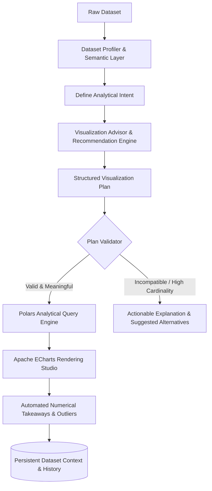

# 01: Product Requirements Document (PRD)

**Project Codename:** `data-vis`  
**Version:** 1.0.0-rc  
**Status:** APPROVED (Source of Truth)  
**Classification:** Core Functional & Non-Functional Specifications  
**Guiding Principle:** *"Don't just show the data. Help the user understand what the data is saying."*

---

## 1. Product Summary

`data-vis` is an offline-first desktop analytics workspace designed for understanding tabular datasets through guided, validated, and interactive visual exploration.

The application explicitly avoids becoming a generic *"CSV → Select Chart → Plot"* utility. Instead, it introduces a **Visualization Advisor** and **Plan Validation Layer** that evaluates column semantics, cardinality, and analytical intent to ensure that every rendered visualization is both *technically executable* and *analytically meaningful*.

---

## 2. Intelligence-First Analytical Lifecycle



---

## 3. Detailed Functional Requirements (FR)

### FR-01: Multi-Format Data Ingestion
- **FR-01.1**: Ingest CSV, TSV (with auto-delimiter detection), Excel (`.xlsx`, `.xls` via `calamine`), JSON/JSONL, and Apache Parquet.
- **FR-01.2**: Drag-and-drop ingestion onto the workspace window, plus native OS file chooser dialogs.
- **FR-01.3**: Cryptographic structural fingerprinting ($\text{SHA256} + \text{CRC32} + \text{Schema}$) for duplicate detection and automatic re-linking of moved files.

### FR-02: Deep Dataset Profiling & Semantic Column Typing
- **FR-02.1**: **Physical Data Types**: Inferred via Polars schema engine (`Boolean`, `Int64`, `Float64`, `String`, `Date`, `Datetime`, `Categorical`).
- **FR-02.2**: **Semantic Column Classification**: Classifies columns beyond raw storage types:
  - `Identifier` (e.g. `show_id`, `UUID`, `EmployeeID` -- high uniqueness, not suitable for aggregation or high-cardinality grouping).
  - `Category` (low/medium cardinality strings/enums -- suitable for grouping and slice comparisons).
  - `Numeric / Continuous` (unbounded numerical measures -- suitable for metrics, histograms, scatter plots).
  - `Currency` / `Percentage` (formatted measures).
  - `Temporal` (`Date`, `Time`, `Datetime`, `Year` -- suitable for time-series trend lines).
  - `Location` (Country, State, City, Zipcode).
  - `Free Text` (long unconstrained text -- excluded from chart axes, suitable for search/extraction).
- **FR-02.3**: **Statistical Profiling**: Computes null rate, distinct count, min/max/mean/median, standard deviation, and duplicate row count.
- **FR-02.4**: **Persistent Display Aliases**: Custom column display names stored in application SQLite without modifying original source files.

---

### FR-03: Visualization Advisor & Compatibility Validation
- **FR-03.1**: **Compatibility & Feasibility Checks**: Evaluates combinations of fields, aggregations, and chart types prior to execution:
  - Blocks invalid operations before query generation (e.g. `SUM(String)` or `Median(Text)`).
  - Warns on high-cardinality categorical dimensions (e.g. grouping by an identifier with 8,790 unique values).
- **FR-03.2**: **Three-Tier Error & Advisory Model**:
  - **Tier 1: Technical Error**: File read failure, memory fault, or syntax failure.
  - **Tier 2: Analytical Incompatibility**: Mathematically impossible mapping (e.g. `SUM(title)`). Execution is halted and the reasoning is explained.
  - **Tier 3: Poor / Degraded Visualization**: Technically possible but practically unreadable (e.g. 5,000 bar categories). UI displays warning with one-click alternatives.
- **FR-03.3**: **Recommendation Explanations**: Recommendations present natural language reasoning (e.g. *"Department is categorical with 5 unique values, while Salary is numerical. Comparing average salary across departments is suitable for a Bar Chart."*).

---

### FR-04: Structured Visualization Plan Architecture
- **FR-04.1**: User interactions, recommendation algorithms, and future SLM advisors compile into a declarative **Visualization Plan**:
  ```json
  {
    "intent": "compare_categories",
    "dimension": "department",
    "metric": "salary",
    "aggregation": "mean",
    "grouping": ["department"],
    "filters": [],
    "sorting": [{ "column": "mean_salary", "descending": true }],
    "chart_type": "bar",
    "limits": 50
  }
  ```
- **FR-04.2**: The **Plan Validator** validates the plan against dataset metadata before sending to the query engine.

---

### FR-05: Dynamic Visualization Studio
- **FR-05.1**: 8 Core isolated chart types:
  - **Bar / Column**: Categorical comparisons.
  - **Line**: Time-series trends.
  - **Scatter Plot**: 2D continuous metric relationships.
  - **Pie / Donut**: Part-to-whole categorical shares.
  - **Area**: Cumulative temporal volume.
  - **Histogram**: Frequency distributions over 10 binned intervals.
  - **Box Plot**: 5-number summary ($[ \text{min}, Q_1, \text{median}, Q_3, \text{max} ]$) with outlier indicators.
  - **Heatmap**: 2D cross-tabular intensity matrix.
- **FR-05.2**: **Option Lifecycle Isolation**: Configured with `notMerge: true` to prevent `visualMap` heat sliders and option trees from bleeding across chart type switches.
- **FR-05.3**: **Context-Aware Adaptive Inspector**: Inspector pane tailors fields dynamically (e.g. Histogram hides grouping and shows single numeric bin metric; Scatter shows X and Y continuous metrics).

---

### FR-06: Unified Interactive Data Workbench (Option C)
- **FR-06.1**: **In-Cell Editing**: Double-click table cell editing with SQLite virtual patch overlays.
- **FR-06.2**: **Calculated Columns**: Polars vectorized formula engine (e.g. `Annual_Salary = Salary * 12`, `Profit = Revenue - Cost`).
- **FR-06.3**: **Type-Aware Cleaning Presets**:
  - **Numeric**: Decimal rounding precision (`precision=2`, `precision=0`), null imputation (mean/median/zero), outlier clamping ($3\sigma$).
  - **Text**: Whitespace trimming, title/upper/lower casing, punctuation removal, null replacement with `"Unknown"`.
- **FR-06.4**: **Transformation History Log**: Audit log with one-click revert / undo actions. Source disk files remain 100% untouched.

---

### FR-07: Natural Language Query (NLQ) & Intelligence
- **FR-07.1**: Zero-LLM, token-based structured NLQ parser converts phrases (e.g. *"average salary by department"*) into structured **Visualization Plans**.
- **FR-07.2**: Automated numerical takeaways, skewness alerts, and outlier warnings generated alongside visual output.

---

### FR-08: Workspace & Multi-Sheet Architecture
- **FR-08.1**: Multi-tab sheet workspace (`Sheet 1`, `Sheet 2`, ...) with 12-column drag-and-drop grid.
- **FR-08.2**: Sequential tab re-indexing on addition and removal.
- **FR-08.3**: Portable Workspace JSON bundle (`.vispack`) export and import.

---

### FR-09: Roadmap -- SLM-Powered Visualization Advisor (Future Milestone)
- **FR-09.1**: **Local SLM Integration**: Future milestone integrating an embedded quantized Small Language Model (e.g. SmolLM2 / Qwen2.5-0.5B via ONNX Runtime / llama.cpp) for natural language reasoning.
- **FR-09.2**: **Structured I/O Boundary**:
  - **Input**: Structured dataset metadata and column profiles (not raw data).
  - **Output**: Strict JSON `Visualization Plan`.
- **FR-09.3**: **Deterministic Authority**: SLM never executes arbitrary code or SQL; all plans pass through the **Plan Validator** and execute via Polars.

---

## 4. Non-Functional Requirements (NFR)

### NFR-01: Performance
- Sub-200ms query latency for filters, aggregations, and binning up to 10M rows.
- Solid 60 FPS interactive rendering on charts.

### NFR-02: Security & Zero Egress
- 100% offline, loopback-only communication (`127.0.0.1:8000`). Zero external telemetry.

### NFR-03: Usability & Typography
- Editorial typography (`Inter`, `Source Serif 4`, `JetBrains Mono`) with WCAG 2.1 AA compliant dark/light themes.
