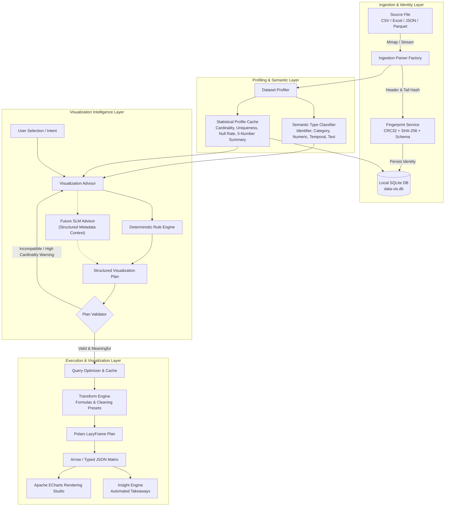

# 02: Data Architecture & Visualization Pipeline Specification

**Project Codename:** `data-vis`  
**Version:** 1.0.0-rc  
**Status:** APPROVED (Source of Truth)  
**Classification:** Core Data Pipeline, Architectural Boundaries & Persistence Model  
**Guiding Principle:** *"Don't just show the data. Help the user understand what the data is saying."*

---

## 1. End-to-End Intelligence Pipeline Architecture

`data-vis` processes data through a decoupled, multi-stage pipeline designed for memory efficiency, lazy evaluation, semantic intelligence, and zero external egress.



---

## 2. Explicit Architectural Responsibility Boundaries

| Component | Core Responsibility | Key Question Answered |
| :--- | :--- | :--- |
| **Dataset Profiler** | Measures row counts, column counts, missing values, duplicates, and numerical distributions. | *"What is this dataset?"* |
| **Semantic Layer** | Assigns semantic meaning (`Identifier`, `Category`, `Numeric`, `Temporal`, `Text`) and evaluates cardinality. | *"What do these columns represent?"* |
| **Visualization Advisor** | Evaluates column combinations, chart suitability, and recommends meaningful mappings with natural language reasoning. | *"What would be useful to visualize?"* |
| **SLM Advisor** *(Roadmap)* | Interprets ambiguous natural language intent against structured metadata to propose candidate plans. | *"Given dataset context and intent, what analytical plan appears appropriate?"* |
| **Visualization Plan** | Declarative specification containing dimensions, metrics, aggregations, filters, sorting, and chart type. | *"What exactly are we trying to calculate and visualize?"* |
| **Plan Validator** | Validates the plan against column physical/semantic types, cardinality, and mathematical compatibility. | *"Is this plan valid and meaningful for this dataset?"* |
| **Query Engine (Polars)** | Vectorized lazy evaluation compiling filters, groupings, and aggregations into optimized bytecode. | *"What are the actual numerical / categorical results?"* |
| **Visualization Engine (ECharts)** | Renders isolated visual mark representations (Bar, Line, Scatter, Box, Heatmap) with responsive interaction. | *"How should those results be presented visually?"* |
| **Insight Engine** | Calculates textual takeaways, outlier flags, dominant categories, and skewness alerts from the result matrix. | *"What notable facts can be derived from the results?"* |

---

## 3. Structured Visualization Plan Specification

All user interactions, NLQ parsers, and future SLM recommendations compile into an authoritative **Visualization Plan**:

```json
{
  "$schema": "https://data-vis.app/schema/vis-plan-v1.json",
  "plan_id": "plan-7f89b",
  "dataset_id": "ds-001",
  "intent": "compare_categories",
  "chart_type": "bar",
  "dimension": {
    "column": "Department",
    "semantic_type": "Category",
    "cardinality": 5
  },
  "metric": {
    "column": "Salary",
    "semantic_type": "Numeric",
    "aggregation": "mean",
    "alias": "mean_Salary"
  },
  "grouping": ["Department"],
  "filters": [
    { "column": "Status", "operator": "equals", "value": "Active" }
  ],
  "sorting": [
    { "column": "mean_Salary", "descending": true }
  ],
  "limits": 50,
  "explanation": "Department is categorical with 5 distinct values, while Salary is numeric. Comparing average salary across departments is suitable for a Bar Chart."
}
```

---

## 4. SQLite Schema Additions (`data-vis.db`)

```sql
-- Column Metadata with Semantic Types & Cardinality Cache
CREATE TABLE IF NOT EXISTS column_metadata (
    id TEXT PRIMARY KEY,                       -- UUID v4
    dataset_id TEXT NOT NULL,                  -- Parent dataset ID
    original_name TEXT NOT NULL,               -- Physical column header in source
    custom_alias TEXT,                         -- User-configured display name
    data_type TEXT NOT NULL,                   -- Physical storage type ('Int64', 'Utf8', etc.)
    semantic_type TEXT NOT NULL DEFAULT 'Unknown', -- 'Identifier'|'Category'|'Numeric'|'Temporal'|'Text'|'Location'
    cardinality INTEGER DEFAULT 0,             -- Distinct count
    null_count INTEGER DEFAULT 0,              -- Missing count
    is_visible INTEGER NOT NULL DEFAULT 1,     -- Visibility toggle
    description TEXT,                          -- User column notes
    FOREIGN KEY(dataset_id) REFERENCES datasets(id) ON DELETE CASCADE,
    UNIQUE(dataset_id, original_name)
);

-- Dataset Transformations Table (Application-Layer Overrides)
CREATE TABLE IF NOT EXISTS dataset_transforms (
    id TEXT PRIMARY KEY,                       -- UUID v4
    dataset_id TEXT NOT NULL,                  -- Target dataset
    action TEXT NOT NULL,                      -- 'calculated_column'|'impute_nulls'|'string_case'|'numeric_precision'|'clamp_outliers'
    name TEXT,                                 -- Name of new calculated column
    formula TEXT,                              -- Formula expression e.g. 'Salary * 12'
    column_name TEXT,                          -- Target column
    strategy TEXT,                             -- Imputation / clean strategy
    mode TEXT,                                 -- String mode ('trim', 'titlecase', etc.)
    precision_val INTEGER,                     -- Rounding decimals
    created_at TEXT NOT NULL,                  -- Timestamp
    FOREIGN KEY(dataset_id) REFERENCES datasets(id) ON DELETE CASCADE
);
```
