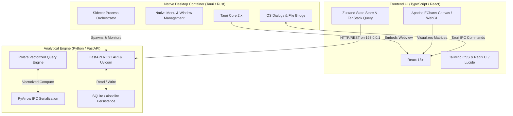

# 03: Technical Stack Specification

**Project Codename:** `data-vis`  
**Version:** 1.0.0-rc  
**Status:** APPROVED (Source of Truth)  
**Classification:** Technology Selection, Runtime Dependencies & Tooling Standards  

---

## 1. High-Level Architecture Overview

`data-vis` utilizes a three-tier hybrid desktop architecture:
1. **Desktop Shell Layer**: Tauri 2.x (Rust) -- native windowing, system dialogs, OS security boundaries, and sidecar process orchestration.
2. **Presentation Layer**: React 18+ (TypeScript / Vite / Tailwind CSS / Apache ECharts) -- responsive, local-first analytical workspace and dashboard canvas.
3. **Compute & Persistence Layer**: FastAPI (Python 3.11+ / Polars / PyArrow / SQLite) -- high-speed vectorized analytical query execution and embedded relational metadata storage.

---

## 2. Technology Selection Matrix & Justifications

### 2.1 Desktop Container: Tauri 2.x vs Electron
| Criterion | Tauri 2.x (Selected) | Electron (Rejected) | Rationale |
| :--- | :--- | :--- | :--- |
| **Binary Bundle Size** | $\sim 15 - 30\text{ MB}$ | $\ge 120\text{ MB}$ | Tauri leverages the operating system's native webview (WebKit / WebView2), radically reducing installer size. |
| **Memory Footprint** | $\sim 40\text{ MB}$ idle | $\ge 150 - 250\text{ MB}$ idle | Minimal Chromium overhead; lower RAM usage leaves memory for data analytics. |
| **Security Model** | Strict IPC isolation, fine-grained capability permissions | Broad Node.js integration in renderer | Hardened sandboxing prevents arbitrary shell execution vulnerabilities. |
| **Sidecar Support** | First-class binary sidecar lifecycle management | Custom child process spawning | Tauri provides native process spawning, health monitoring, and kill-on-exit hooks. |

### 2.2 Analytical Compute Engine: Polars vs DuckDB vs Pandas
| Criterion | Polars (Selected) | DuckDB | Pandas (Rejected) | Rationale |
| :--- | :--- | :--- | :--- | :--- |
| **Query Engine** | Vectorized, multithreaded Rust core with Python bindings | Vectorized SQL OLAP engine | Single-threaded Python bytecode | Polars provides optimal Python expression chaining (`LazyFrame`) and blazing throughput. |
| **Streaming / Out-of-Core** | Built-in streaming query engine | Built-in streaming | High RAM overhead, OOMs on large files | Capable of processing CSVs larger than available physical RAM. |
| **Arrow Native** | 100% Apache Arrow in-memory format | Custom DuckDB vectors | Non-native Arrow representation | Direct zero-copy serialization over Arrow IPC streams. |

### 2.3 Visualization Engine: Apache ECharts vs D3 vs Plotly
| Criterion | Apache ECharts (Selected) | D3.js | Plotly.js (Rejected) | Rationale |
| :--- | :--- | :--- | :--- | :--- |
| **Rendering Performance** | Canvas & WebGL with automatic LOD (Level of Detail) decimation | SVG DOM manipulation (slow $> 10\text{k}$ nodes) | WebGL & SVG, heavy bundle size | ECharts renders $500,000+$ points smoothly at 60 FPS. |
| **Declarative Config** | Pure declarative JSON option model | Procedural DOM manipulation | JSON / Declarative | Declarative options serialize cleanly into SQLite and workspace files. |
| **Interactive Tooling** | Built-in dataZoom, brush, toolbox, crosshair | Requires manual implementation | Heavyweight interaction widgets | Rich out-of-the-box analytical toolbars with minimal boilerplate. |

---

## 3. Detailed Component Stacks

### 3.1 Frontend Stack
- **Framework**: React 18.3+ with TypeScript 5.4+ (Strict Mode enabled).
- **Bundler & Dev Server**: Vite 5.x (Fast HMR, optimized ESM builds).
- **Styling**: Tailwind CSS 3.4+ with `@tailwindcss/forms` and `clsx` / `tailwind-merge`.
- **UI Primitives & Icons**: Radix UI primitives (Dialog, DropdownMenu, Tooltip, Popover, Slider) + `lucide-react` icons.
- **Client State Management**: Zustand 4.5+ for UI and workspace state; Immer for immutable state transitions.
- **Server Cache & Async Management**: TanStack Query v5 (React Query) for API fetching, caching, and optimistic updates.
- **Data Visualization**: `echarts` 5.5+ and `echarts-for-react`.
- **Data Grid Canvas**: `@tanstack/react-table` v8 for virtualized tabular data exploration.
- **Grid Layout System**: `react-grid-layout` for draggable/resizable dashboard cards.

### 3.2 Backend & Engine Stack
- **Web Framework**: FastAPI 0.111+ (ASGI framework running on Uvicorn).
- **Python Runtime**: Python 3.11 or 3.12 (packaged via standalone binary / PyInstaller sidecar).
- **Vectorized Data Engine**: `polars` 0.20+ with `pyarrow` 16.0+.
- **File Parsers**:
  - CSV/TSV: Polars native multi-threaded parser.
  - Excel: `calamine` (Rust engine via `python-calamine` / `fastexcel`) and `openpyxl`.
  - JSON/Parquet: Polars native streaming readers.
  - XML: `lxml` and `defusedxml` (hardened against XML entity injection).
- **Database & ORM**: SQLite 3 with `aiosqlite` (asynchronous I/O) and lightweight repository query layer.
- **Data Validation & Contracts**: Pydantic v2 (Strict typing, JSON schema generation).

### 3.3 Desktop & Packaging Stack
- **Desktop Container**: Tauri 2.0+ (Rust 1.77+ edition 2021).
- **Sidecar Manager**: Tauri native sidecar plugin orchestrating the Python FastAPI executable.
- **Bundlers**:
  - Desktop installer: Tauri CLI (`cargo tauri build`).
  - Python sidecar: PyInstaller / `uv` standalone binary packager.

---

## 4. Development & QA Tooling

- **Package Managers**: `pnpm` (Node.js workspace) and `uv` / `poetry` (Python virtual environment).
- **Linters & Formatters**:
  - Frontend: ESLint with TypeScript-ESLint, Prettier.
  - Backend: `ruff` (Blazing fast Python linter & code formatter replacing Flake8, Black, isort).
  - Rust: `clippy` and `cargo fmt`.
- **Test Frameworks**:
  - Frontend Unit & Component: `vitest` + `@testing-library/react` + `jsdom`.
  - Backend Unit & Integration: `pytest` + `pytest-asyncio` + `httpx`.
  - E2E & Desktop Integration: `playwright` and Tauri WebDriver.
- **Type Checking**: `tsc --noEmit` (TypeScript) and `mypy` / `pyright` (Python).
