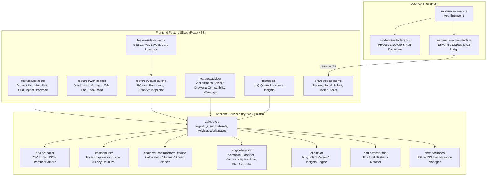

# 05: Component Specifications & System Boundaries

**Project Codename:** `data-vis`  
**Version:** 1.0.0-rc  
**Status:** APPROVED (Source of Truth)  
**Classification:** Modular Breakdown, Feature Slices, Backend Services & IPC Contracts  
**Guiding Principle:** *"Don't just show the data. Help the user understand what the data is saying."*

---

## 1. System Module Overview

The application codebase is partitioned into three distinct sub-projects within a monorepo structure:
- `apps/desktop/src-tauri`: Rust desktop host, native IPC commands, sidecar launcher.
- `apps/desktop/src`: React/TypeScript frontend feature slices.
- `packages/backend`: Python/FastAPI/Polars analytical service.

---

## 2. Desktop Shell Specifications (`src-tauri`)

### 2.1 Sidecar & IPC Orchestrator (`sidecar.rs`)
- Locates the Python sidecar binary (or virtualenv in dev mode).
- Probes for an unused ephemeral TCP port or initializes Unix Domain Socket (`/tmp/data-vis-{session}.sock`) / Named Pipe.
- Spawns backend process with loopback binding (`127.0.0.1:8000`), supervising process health.

### 2.2 Native Command Bridge (`commands.rs`)
- `open_file_dialog(filters: Vec<String>) -> Result<Option<String>, String>`: Native file picker.
- `save_file_dialog(default_name: String, filters: Vec<String>) -> Result<Option<String>, String>`: Native save dialog.

---

## 3. Frontend Feature Slices (`apps/desktop/src`)

### 3.1 `features/datasets`
- **`DatasetDropzone.tsx`**: Drag-and-drop file target triggering native upload or path registration.
- **`DatasetList.tsx`**: Renders linked datasets with status badge, record counts, active selection, table exploration trigger, and purge action.
- **`DatasetExplorerModal.tsx`**: Virtualized spreadsheet modal with pagination, global search, column sorting, in-cell double-click value editing, calculated columns action bar, and dataset health summary metrics (% Quality, null rate, duplicates).
- **`ColumnMetadataEditor.tsx`**: Inline editor for renaming column display aliases (`custom_alias`) without touching source files.

### 3.2 `features/visualizations`
- **`EChartContainer.tsx`**: Wrapper around `echarts-for-react` with `notMerge={true}` option lifecycle isolation, `ResizeObserver`, window resize listener, and viewport-confined tooltips (`confine: true`).
- **`ChartConfigurator.tsx`**: Adaptive inspector pane dynamically tailoring fields to active chart type, intelligent column filtering (numeric-only for scatter/hist/box), and multi-valued list dimension exploding toggle ("Treat multiple values separately").
- **`QuickVisualModeDropdown.tsx`**: Header dropdown component providing 1-click access to the 10 light and dark graph surface presets.
- **`useEChartsOptions.ts`**: Reactive hook transforming raw Polars analytical response matrices into typed ECharts option trees with instant theme and surface preset repainting.

### 3.3 `features/dashboards`
- **`DashboardGrid.tsx`**: Multi-card canvas layout manager with drag-and-drop cards.
- **`ChartCard.tsx`**: Chart card wrapper with header controls, drill-down trigger, maximize, and multi-monitor popout detachment.
- **`PopoutCardView.tsx`**: Full-bleed detached native window viewer featuring 1-click **"Re-attach to Workspace"** docking and responsive scaling.

### 3.4 `features/settings`
- **`SettingsModal.tsx`**: Central session and visual gallery dialog featuring sparkline visual previews, LTTB decimation controls, and system diagnostics.

### 3.5 `features/advisor`
- **`AdvisorPanel.tsx`**: Displays candidate visualization plans with natural language reasoning.
- **`CompatibilityBadge.tsx`**: Renders analytical feasibility warnings when invalid or high-cardinality fields are selected.

### 3.6 `features/workspaces`
- **`workspaceStore.ts`**: Zustand store backed by `persist` LocalStorage middleware for instant cross-window state synchronization, sheet tabs (`Sheet 1`, `Sheet 2`), active sheet pointer, card layout coordinates, and linear undo/redo stacks.
- **`WorkspaceTabBar.tsx`**: Excel-style sheet tab bar with active state indicator and per-tab close button.

---

## 4. Backend Service Modules (`packages/backend`)

### 4.1 Ingestion & Transform Engine
- **`ParserFactory`**: CSV, Excel (`calamine`), JSON/JSONL, and Parquet parsers.
- **`TransformEngine`**: Vectorized application-side calculated columns (e.g. `Salary * 12`), numeric precision rounding, outlier clamping, and null imputation without modifying source files.

### 4.2 Visualization Advisor & Compatibility Engine (`engine/advisor`) (New Module)
- **`SemanticClassifier`**: Infers semantic types (`Identifier`, `Category`, `Numeric`, `Temporal`, `Location`, `Text`) from physical types and cardinality.
- **`PlanValidator`**: Validates `VisualizationPlan` against column compatibility rules (e.g. rejects `SUM(String)`, flags high-cardinality identifiers on X-axis).
- **`RecommendationEngine`**: Generates ranked candidate visualization plans with natural language explanations.

### 4.3 Query Execution Engine (`engine/query`)
- **`QueryCompiler`**: Compiles `QueryDTO` / `VisualizationPlan` into `polars.LazyFrame`.
- **`ExpressionBuilder`**: Converts filter and aggregation specifications into native Polars `pl.col()` expressions.
