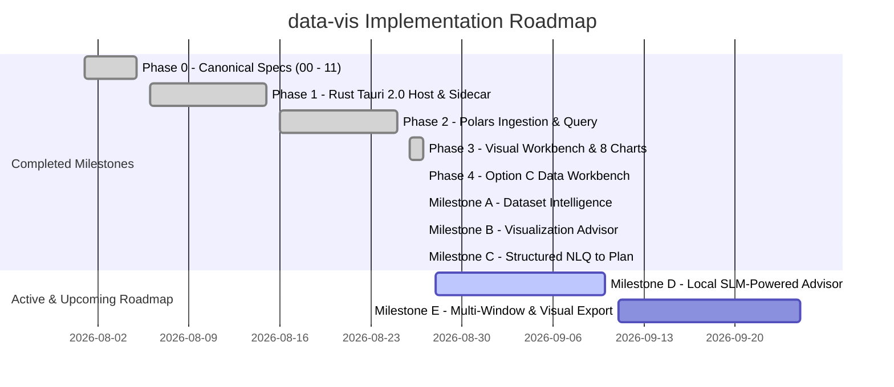

# 07: Phased Implementation Plan & Milestones

**Project Codename:** `data-vis`  
**Version:** 1.0.0-rc  
**Status:** APPROVED (Source of Truth)  
**Classification:** Phase-by-Phase Roadmap, Deliverables & Exit Criteria  
**Guiding Principle:** *"Don't just show the data. Help the user understand what the data is saying."*

---

## 1. Phased Development Model

In strict accordance with the [*Development Directive*](./docs/12_DEVELOPMENT_DIRECTIVE.md), development advances through distinct sequential phases. No phase begins until the exit criteria of the preceding phase are fully satisfied and documented.

---

## 2. Completed Milestones Review

### Foundation: Ingestion, Engine & Native Desktop Shell
- Multi-format ingestion (CSV, TSV, Excel via `calamine`, JSON/JSONL, Parquet).
- Cryptographic structural fingerprinting ($\text{SHA256} + \text{CRC32} + \text{Schema}$) with idempotent duplicate detection.
- Vectorized Polars query compiler (filters, groupings, aggregations, sorting, pagination).
- Tauri 2.0 Rust desktop shell with automatic Python sidecar supervisor and loopback binding (`127.0.0.1:8000`).

### Visual Workbench & 8-Chart Studio
- Warm neutral editorial design tokens (`--bg-surface: #f4f0e8;`, `--bg-app: #121110;`).
- 8 Core chart renderers: Bar, Line, Scatter, Pie, Area, Histogram (10-bin intervals), Box Plot (5-number summary with quartiles), and Heatmap.
- **Visualizer Lifecycle Isolation**: `notMerge={true}` preventing `visualMap` heat sliders and option trees from bleeding across chart type switches.
- **Context-Aware Adaptive Inspector**: Inspector fields adapt dynamically per chart type (e.g. Histogram hides redundant grouping and shows single numeric bin metric; Scatter shows continuous X and Y metrics).

### Option C: Unified Interactive Data Workbench
- Double-click in-cell editing with SQLite virtual cell override overlays.
- Vectorized calculated columns via Polars expressions (e.g. `Salary * 12`, `Profit = Revenue - Cost`).
- Context-aware data cleaning presets (Numeric precision rounding, null imputation with mean/median/zero, string trimming, casing conversion).
- Transformation audit history log with one-click revert actions. Source disk files remain 100% untouched.

### Milestone A: Dataset Intelligence & Semantic Profiling
- **Semantic Column Classifier**: Automatically infers `Identifier`, `Category`, `Numeric`, `Temporal`, `Date`, `Year`, `Location`, `Text`, and `List` semantic types.
- **Exact Cardinality & Uniqueness Engine**: Computes $N_{\text{distinct}}$ and uniqueness ratios ($\frac{N_{\text{distinct}}}{N_{\text{rows}}}$) for every column.
- **Header Badges & Profile Drawer**: High-contrast badges in table headers and advisory cards in the dataset column inspector.

### Milestone B: Visualization Advisor & Compatibility Layer
- **Pre-Execution Plan Validator (`PlanValidator`)**: Enforces 3-Tier error handling:
  - **Tier 2 (Analytical Incompatibility Block)**: Rejects invalid mathematical mappings (e.g. `SUM(title)`) before execution and provides 1-click alternative fixes.
  - **Tier 3 (High-Cardinality Warning)**: Warns when selecting $>50$ distinct categories on Bar/Pie charts.
- **Recommendation Engine with Natural Language Reasoning**: Produces ranked candidate `VisualizationPlans` with confidence scores and clear explanations.
- **Live Advisor Inspector**: Real-time validation banner with 1-click fixes and a **"✨ Advisor Recommendations"** drawer for 1-click plan application.
- **Chronological Date Sorting**: Vectorized Polars date parsing ensuring $1/1/2020 \to 1/2/2020 \to 1/1/2021$ rather than alphabetical ordering.
- **Multi-Value List Splitting**: Vectorized Polars list explosion (`split_and_unnest`) for comma-separated columns.

### Milestone C: Structured NLQ to Visualization Plan & Automated Insights
- **Structured NLQ Compiler (`NLQCompiler`)**: Compiles natural language questions into declarative `VisualizationPlan` JSON utilizing column semantics.
- **Pre-Execution NLQ Validation**: Every NLQ-generated plan is validated via `PlanValidator` before card creation.
- **Interactive NLQ Command Bar (`NaturalLanguageQueryBar`)**: Integrated dataset suggestion chips, real-time plan explanation feedback, and instant canvas card generation.

---

## 3. Active & Upcoming Milestones

### Milestone D: Local SLM-Powered Visualization Advisor (Next Focus)
* **Scope**:
  - Integrate a lightweight local SLM runtime (`llama-cpp-python` / ONNX Runtime) running quantized models (e.g. `Qwen2.5-0.5B-Instruct` or `SmolLM2-360M`) 100% offline with zero cloud egress.
  - Define structured prompt template passing only column metadata, semantic types, and cardinality statistics (never raw data).
  - Constrain SLM generation to valid `VisualizationPlan` JSON matching our established schema.
  - Hybrid rule + SLM architecture with seamless fallback to `NLQCompiler` if the SLM is uninitialized.
  - Authoritative deterministic validation: all SLM output must pass through `PlanValidator` and execute via Polars.
* **Exit Criteria**:
  - User can ask complex, open-ended analytical questions (e.g. *"Identify interesting patterns in this catalog"*), and the local SLM proposes validated `VisualizationPlans` with natural language explanations.

---

### Milestone E: Multi-Window Canvas & High-Resolution Visual Exports
* **Scope**:
  - 300 DPI PNG, Vector SVG, and formatted CSV / Excel exports from any chart.
  - Detached multi-monitor window management via Tauri webview IPC.
  - Presentation controls (Data Labels, Gridlines, Legend visibility, and Palette presets).
* **Exit Criteria**:
  - User can export publication-grade SVG and 300 DPI PNG images with 1 click.
