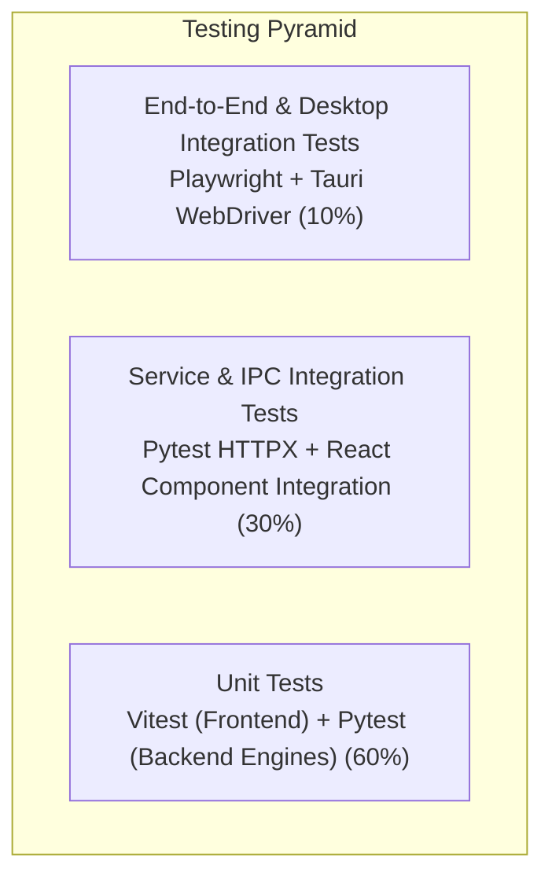

# 09: Testing, Quality Assurance & Benchmarking Specification

**Project Codename:** `data-vis`  
**Version:** 1.0.0-rc  
**Status:** APPROVED (Source of Truth)  
**Classification:** Test Pyramid, Automation Suites, Coverage Targets & QA Protocols  

---

## 1. Testing Strategy & Pyramid

`data-vis` employs a strict multi-layer testing pyramid to ensure analytical correctness, memory safety, and UI responsiveness.



---

## 2. Test Coverage & Quality Gates

| Layer | Framework / Tool | Minimum Line Coverage | Target Scope |
| :--- | :--- | :--- | :--- |
| **Backend Engine** | `pytest` + `pytest-cov` | $\ge 90\%$ | Ingestion parsers, Polars query compiler, expression builder, fingerprinting, SQLite repositories. |
| **Backend API** | `pytest` + `httpx` (AsyncClient) | $\ge 85\%$ | Request validation, error envelope formatting, health contracts, router endpoints. |
| **Frontend Stores & Utils** | `vitest` | $\ge 85\%$ | Zustand state reducers, query builders, formatting utilities, option compilers. |
| **Frontend Components** | `vitest` + `@testing-library/react` | $\ge 80\%$ | Dropzone, schema viewer, filter builder, chart card actions, modal dialogs. |
| **Desktop / E2E** | `playwright` | Core Critical Paths | File drop $\to$ schema inspection $\to$ chart generation $\to$ export flow. |

---

## 3. Backend Test Suite (`pytest`)

### 3.1 Test Categories & File Organization
```
packages/backend/tests/
├── test_stress_benchmarks.py    # 1M-row scale, multi-value exploding, sort invariance & dirty fuzzing
├── test_advisor.py              # 3-tier PlanValidator, recommendation engine & advisor endpoints
├── test_semantic_classifier.py  # Semantic column profiling (Identifier, Category, Numeric, Date, List)
├── test_transforms.py           # Polars calculated columns, clean presets & split_and_unnest
├── test_ai.py                   # Structured NLQ parser & automated insights generator
├── test_datasets.py             # Dataset schema update, metadata & statistics endpoints
├── test_query.py                # Polars query compiler, multi-column search & chronological sort
├── test_ingest.py               # Ingestion parsers (CSV, JSON, Excel, Parquet) & fingerprinting
├── test_db.py                   # SQLite repository CRUD operations & cascade deletes
└── test_health.py               # Health & system configuration endpoints
```

### 3.2 Key Assertions for Analytical Engine
- **Correctness**: Aggregations must yield mathematically exact results compared with reference computations.
- **Null Safety**: All filter operators (`eq`, `neq`, `contains`, etc.) must handle `null` values gracefully without panicking or returning invalid rows.
- **Type Coercion**: Type casting must handle malformed strings gracefully without crashing the worker process.

---

## 4. Frontend Test Suite (`vitest`)

### 4.1 Component & Hook Testing
```
apps/desktop/src/
├── features/datasets/__tests__/
│   ├── DatasetDropzone.test.tsx     # File drag-and-drop triggers upload API
│   └── SchemaViewer.test.tsx        # Type pills and alias inputs reflect store state
├── features/visualizations/__tests__/
│   ├── EChartContainer.test.tsx     # Handles resize observer events and theme swaps
│   └── useEChartsOptions.test.ts    # Transforms query DTO into valid ECharts JSON tree
└── features/workspaces/__tests__/
    └── workspaceStore.test.ts       # Undo/redo stack pops and pushes correctly
```

---

## 5. Performance & Stress Benchmarks

Before any release, the following automated benchmark suite must pass:

1. **10 Million Rows Aggregation**:
   - Query: Group by categorical column (100 distinct keys) with `sum`, `mean`, `count` aggregations over 10M rows.
   - Requirement: Total execution time $\le 200\text{ ms}$.
2. **500MB CSV Ingestion & Profiling**:
   - Ingestion + schema inference must complete in $\le 15\text{ seconds}$.
3. **Memory Footprint Profile**:
   - Baseline idle backend RSS $\le 120\text{ MB}$.
   - Peak RSS during 10M row streaming query $\le 512\text{ MB}$.
4. **UI Render Frame Rate**:
   - Continuous zoom and pan over 100,000 points must sustain $\ge 55\text{ FPS}$.

---

## 6. QA Release Checklist

- [ ] All automated unit and integration tests passing (`pnpm test`, `pytest`).
- [ ] No ESLint or Ruff warnings.
- [ ] TypeScript compiles cleanly with zero errors (`tsc --noEmit`).
- [ ] Python type checker passes (`mypy` / `pyright`).
- [ ] Benchmark latency targets verified on reference hardware.
- [ ] Dark Mode and Light Mode visual contrast verified with axe-core / WCAG AA scanner.
- [ ] Cross-platform builds (Linux, macOS, Windows) generated and verified.
