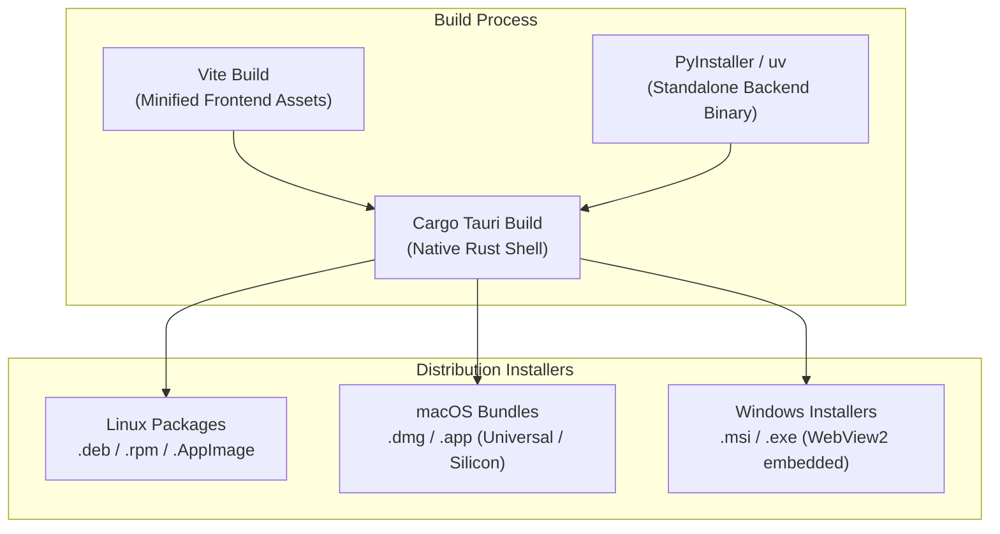

# 10: Deployment, DevOps & Packaging Specification

**Project Codename:** `data-vis`  
**Version:** 1.0.0-rc  
**Status:** APPROVED (Source of Truth)  
**Classification:** Cross-Platform Packaging, CI/CD Pipelines & Release Distribution  

---

## 1. Packaging Architecture

`data-vis` is packaged into a self-contained, native installer for each target operating system. The installer bundles:
1. **The Native Desktop Shell**: Compiled Tauri Rust binary with embedded webview runtime interfaces.
2. **The Frontend Assets**: Static, minified HTML/JS/CSS bundle generated by Vite.
3. **The Backend Analytical Sidecar**: A standalone, self-contained Python executable created with PyInstaller, bundling the FastAPI server, Polars engine, and compiled C/Rust extensions.



---

## 2. Platform Targets & Formats

| Platform | Architecture | Distribution Formats | Code Signing Requirements |
| :--- | :--- | :--- | :--- |
| **Linux** | `x86_64`, `aarch64` | `.deb` (Debian/Ubuntu), `.rpm` (Fedora/RHEL), `.AppImage` (Universal) | Optional GPG signature |
| **macOS** | `Apple Silicon (arm64)`, `Intel (x86_64)` | `.dmg`, `.app` (Universal binary) | Apple Developer ID + Notarization |
| **Windows** | `x86_64` | `.msi` (WiX Toolset), `.exe` (NSIS Installer) | Microsoft Authenticode Code Signing Certificate |

---

## 3. CI/CD Pipeline Specification (GitHub Actions)

### 3.1 Workflow Matrix

```yaml
# .github/workflows/ci-cd.yml
name: CI / CD Pipeline

on:
  push:
    branches: [main, develop]
    tags: ['v*']
  pull_request:
    branches: [main]

jobs:
  lint-and-typecheck:
    name: Lint & Typecheck (Frontend & Backend)
    runs-on: ubuntu-latest
    steps:
      - uses: actions/checkout@v4
      - uses: pnpm/action-setup@v3
        with:
          version: 9
      - uses: actions/setup-node@v4
        with:
          node-version: 20
          cache: 'pnpm'
      - run: pnpm install
      - run: pnpm lint
      - run: pnpm typecheck
      - uses: actions/setup-python@v5
        with:
          python-version: '3.11'
      - run: pip install ruff mypy
      - run: cd packages/backend && ruff check . && ruff format --check .

  test-backend:
    name: Pytest Analytical Engine
    runs-on: ubuntu-latest
    steps:
      - uses: actions/checkout@v4
      - uses: actions/setup-python@v5
        with:
          python-version: '3.11'
      - run: |
          cd packages/backend
          pip install -e ".[dev]"
          pytest -v --cov=engine --cov=api --cov-report=xml

  test-frontend:
    name: Vitest & Component Specs
    runs-on: ubuntu-latest
    steps:
      - uses: actions/checkout@v4
      - uses: pnpm/action-setup@v3
      - uses: actions/setup-node@v4
        with:
          node-version: 20
      - run: pnpm install
      - run: pnpm test

  build-release-artifacts:
    name: Build Desktop Bundles (${{ matrix.platform }})
    needs: [lint-and-typecheck, test-backend, test-frontend]
    if: startsWith(github.ref, 'refs/tags/v')
    strategy:
      fail-fast: false
      matrix:
        include:
          - platform: ubuntu-22.04
            target: x86_64-unknown-linux-gnu
          - platform: macos-latest
            target: universal-apple-darwin
          - platform: windows-latest
            target: x86_64-pc-windows-msvc
    runs-on: ${{ matrix.platform }}
    steps:
      - uses: actions/checkout@v4
      - name: Setup Rust Toolchain
        uses: dtolnay/rust-toolchain@stable
        with:
          targets: ${{ matrix.target }}
      - name: Build Python Sidecar Binary
        run: |
          cd packages/backend
          pip install pyinstaller -e .
          pyinstaller --noconfirm --clean sidecar.spec
      - name: Build Tauri Desktop Bundle
        uses: tauri-apps/tauri-action@v0
        env:
          GITHUB_TOKEN: ${{ secrets.GITHUB_TOKEN }}
        with:
          tagName: v__VERSION__
          releaseName: 'data-vis v__VERSION__'
          releaseBody: 'See release notes for details.'
          releaseDraft: false
          prerelease: false
```

---

## 4. Release Strategy & Versioning

- **Semantic Versioning (SemVer)**: `vMAJOR.MINOR.PATCH` (e.g. `v1.0.0`).
- **Release Channels**:
  - `Nightly`: Automated nightly builds from `develop` branch.
  - `Beta`: Feature-freeze release candidates (`v1.0.0-rc.1`).
  - `Stable`: Tagged production releases with signed artifacts and checksums (`SHA256SUMS.txt`).
- **Auto-Update Mechanism**: Tauri built-in updater checking GitHub Releases API for new signed version manifests with differential patching.
