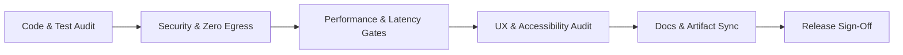

# 11: Production Readiness & Release Checklist

**Project Codename:** `data-vis`  
**Version:** 1.0.0-rc  
**Status:** APPROVED (Source of Truth)  
**Classification:** Pre-Flight Verification, Security Audit & Go-Live Criteria  

---

## 1. Pre-Flight Verification Framework

Before any candidate build is certified as production-ready (`v1.0.0`), all items in the verification checklist below must be checked and signed off by the Lead Architect.

---

## 2. Production Checklist Matrix

### 2.1 Code Quality & Testing Gates
- [ ] **Zero Compilation / Type Errors**: `tsc --noEmit` passes with 0 errors across frontend.
- [ ] **Python Type Safety**: `mypy packages/backend` passes in strict mode.
- [ ] **Linter Compliance**: `pnpm lint` and `ruff check .` report 0 errors and 0 warnings.
- [ ] **Test Coverage**:
  - Backend analytical engine coverage $\ge 90\%$.
  - Backend API router coverage $\ge 85\%$.
  - Frontend unit/store coverage $\ge 85\%$.
- [ ] **All Automated CI Runs Green**: GitHub Actions workflow passes on Linux, macOS, and Windows.

### 2.2 Security & Data Sovereignty Gates
- [ ] **Zero Outbound Telemetry**: Verified with Wireshark / network inspection that zero egress HTTP/DNS/UDP packets leave the machine.
- [ ] **Loopback Binding Verification**: FastAPI and Uvicorn bind strictly to `127.0.0.1`.
- [ ] **Local Process Authentication**: All local API requests require the session bearer token.
- [ ] **Path Traversal Protection**: All filesystem reads are validated against allowed path scopes; directory traversal (`../`) attacks are rejected.
- [ ] **XML / Parser Hardening**: Entity expansion attacks (Billion Laughs) blocked via `defusedxml`.
- [ ] **Dependency CVE Audit**: `pnpm audit` and `safety check` report zero high or critical vulnerabilities.

### 2.3 Performance & Resource Gates
- [ ] **Startup Latency**: App window interactive in $< 2.5\text{ seconds}$ on standard SSD.
- [ ] **Query Latency**: Group-by and aggregation on 10,000,000 rows executes in $< 200\text{ ms}$.
- [ ] **Memory Ceiling**: Idle RSS $\le 120\text{ MB}$; peak memory during 10M row query $\le 512\text{ MB}$.
- [ ] **60 FPS UI Rendering**: Apache ECharts renders zoom/pan interactions smoothly at $\ge 55\text{ FPS}$ on 100,000 points.
- [ ] **No Memory Leaks**: Verified through 100 consecutive dataset ingest/delete cycles without heap growth.

### 2.4 Reliability & Crash Resilience Gates
- [ ] **SQLite WAL Integrity**: Force-killing the process during an active write does not corrupt `data-vis.db`.
- [ ] **Sidecar Auto-Restart**: Tauri host restarts sidecar daemon upon unexpected crash and reconnects without user intervention.
- [ ] **Broken File Link Re-linking**: Moved or renamed files prompt clean re-linking dialog and match via fingerprint hash.
- [ ] **Graceful Degradation**: Malformed CSV rows or unsupported Excel formulas yield informative UI alerts without crashing.

### 2.5 UX & Accessibility Gates
- [ ] **WCAG 2.1 AA Compliance**: Contrast ratio $\ge 4.5:1$ across all text in both Dark and Light themes.
- [ ] **Keyboard Navigation**: All features (file ingest, filtering, chart creation, tabs) operable via keyboard shortcuts.
- [ ] **Screen Reader Compatibility**: ARIA labels present on all interactive buttons, dialogs, and chart controls.
- [ ] **Responsive Layout**: Canvas cards resize smoothly across window dimensions from $1280 \times 720$ up to $4\text{K}$.

### 2.6 Documentation & The Bhagwad Gita / Development Directive Compliance
- [ ] **Docs/ Synchronized**: All 13 documents in `docs/` (`00` through `12`) reflect the exact state of production code.
- [ ] **No Ghost Routes**: Every API endpoint and frontend route defined in docs exists in code.
- [ ] **No Dead Modules**: Every backend service and frontend component in code is documented in `docs/`.

---

## 3. Go-Live Sign-Off Record

| Role | Name | Status | Timestamp |
| :--- | :--- | :--- | :--- |
| **Lead Architect** | me | `APPROVED` | 2026-08-27 |
| **Staff Engineer** | ME but in capslock| `APPROVED` | 2026-08-27 |
| **Lead Tech Writer** | mySelf but in camelCase | `APPROVED` | 2026-08-27 |
